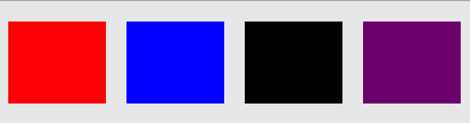
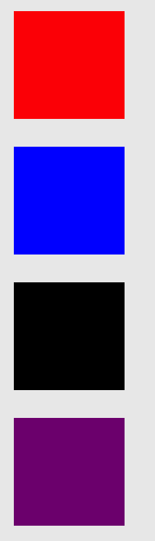

# ElegantSnap

基于SnapKit, 用法简洁优雅,可运行在iOS、tvOS、macOS上自动布局库，支持链式调用

ElegantSnap(Base on SnapKit) to make Auto Layout easy and elegant on both iOS and OS X.


[](https://github.com/ZuopanYao/ElegantSnap)
[](https://cocoapods.org/pods/ElegantSnap)
[](https://github.com/Carthage/Carthage)

## Requirements / 使用条件

- iOS 10.0+ / Mac OS X 10.12+ / tvOS 10.0+
- Xcode 10.2+
- Swift 5.0+


## Installation / 安装

### CocoaPods

```
pod 'ElegantSnap'
```

### Carthage

```
github "ZuopanYao/ElegantSnap" 
```

### Manually / 手动安装

If you prefer not to use either of the aforementioned dependency managers, you can integrate SnapKit into your project manually.

如果您不喜欢以上管理依赖库的方式，则可以手动将 ElegantSnap 集成到项目中。


## Usage / 使用

### Compare with SnapKit / 与 SnapKit 比较

| ElegantSnap | SnapKit |
|:------|:----|
|aView.make([.top()])<br> // aView.make([.top(nil, nil)])<br> // aView.make([.top(nil)])|aView.snp.makeConstraints { (make) in<br/> &nbsp;&nbsp;&nbsp;&nbsp;make.top.equalToSuperview()<br/> }|
|aView.make([.top(20)])<br> // aView.make([.top(nil, 20)])<br>|aView.snp.makeConstraints { (make) in<br/> &nbsp;&nbsp;&nbsp;&nbsp;make.top.equalToSuperview().offset(20)<br/> }|
|aView.make([.top(base.snp.bottom)])<br> // aView.make([.top(base.snp.bottom, nil)])<br>|aView.snp.makeConstraints { (make) in<br/> &nbsp;&nbsp;&nbsp;&nbsp;make.top.equalTo(base.snp.bottom)<br/> }|
|aView.make([.top(base.snp.bottom, 20)])|aView.snp.makeConstraints { (make) in<br/> &nbsp;&nbsp;&nbsp;&nbsp;make.top.equalTo(base.snp.bottom).offset(20)<br/> }|
|...|...|
|aView.make([.width()])<br> // aView.make([.width(nil)])|aView.snp.makeConstraints { (make) in<br/> &nbsp;&nbsp;&nbsp;&nbsp;make.top.equalToSuperview()<br/> }|
|aView.make([.width(200)])|aView.snp.makeConstraints { (make) in<br/> &nbsp;&nbsp;&nbsp;&nbsp;make.width.equalTo(200)<br/> }|
|aView.make([.width(base.snp.width)])|aView.snp.makeConstraints { (make) in<br/> &nbsp;&nbsp;&nbsp;&nbsp;make.width.equalTo(base.snp.width)<br/> }|
|...|...|


### Quick Start / 快速上手

#### Example 1 / 示例 1

```swift
import ElegantSnap

class ViewController: NSViewController {
    
    override func viewDidLoad() {
        super.viewDidLoad()
        
        let aView = NSView()
        view.addSubview(aView, constraints: [.top(), .leading(), .width(200), .height(400)])
        
        // OR Chian 链式使用
        // v1.5.0+
        // view.addSubview(aView) { $0.top().leading().width(200).height(400).end() }
        
        // view.addSubview(aView)
        // aView.make([.top(), .leading(), .width(200), .height(400)])
         
        // OR Chian 链式使用
        // v1.5.0+
         view.make { $0.top().leading().width(200).height(400).end() }
    }
}
```

equal to / 等同于

```swift
import SnapKit

class ViewController: NSViewController {
    
    override func viewDidLoad() {
        super.viewDidLoad()
        
        let aView = NSView()
        view.addSubview(aView)
                
        aView.snp.makeConstraints { (make) in
            make.top.equalToSuperview()
            make.leading.equalToSuperview()
            make.width.equalTo(200)
            make.height.equalTo(400)
        }
    }
}
```

#### Example 2 / 示例 2

```swift
import ElegantSnap

class ViewController: NSViewController {
    
    override func viewDidLoad() {
        super.viewDidLoad()
        
        let aView = NSView()
        view.addSubview(aView, constraints: [.top(), .leading(), .width(200), .height(400)])
        
        // OR Chian 链式使用
        // v1.5.0+
        // view.addSubview(aView) { $0.top().leading().width(200).height(400).end() }
        
        let myView = NSView()
        view.addSubview(myView, constraints: [.top(aView.snp.bottom, 20), .leading(), .width(300), .height(aView.snp.height)])
        
        // OR Chian 链式使用
        // v1.5.0+
        // view.addSubview(myView) { $0.top(aView.snp.bottom, 20).leading().width(300).height(aView.snp.height).end() }
    }
    
}
```

equal to / 等同于

```swift
import SnapKit

class ViewController: NSViewController {
    
    override func viewDidLoad() {
        super.viewDidLoad()
        
        let aView = NSView()
        view.addSubview(aView)
                
        aView.snp.makeConstraints { (make) in
            make.top.equalToSuperview()
            make.leading.equalToSuperview()
            make.width.equalTo(200)
            make.height.equalTo(400)
        }
        
        let myView = NSView()
        view.addSubview(myView)
        
        myView.snp.makeConstraints { (make) in
            make.top.equalTo(aView.snp.bottom).offset(20)
            make.leading.equalToSuperview()
            make.width.equalTo(300)
            make.height.equalTo(aView.snp.height)
        }
    }
}
```

### 多视图排列

#### 多个View等宽水平排列

```swift
import ElegantSnap

class ViewController: NSViewController {
    
    override func viewDidLoad() {
        super.viewDidLoad()
                
        let aView = NSView()
        aView.wantsLayer = true
        aView.layer?.backgroundColor = NSColor.red.cgColor
        
        let bView = NSView()
        bView.wantsLayer = true
        bView.layer?.backgroundColor = NSColor.blue.cgColor
        
        let cView = NSView()
        cView.wantsLayer = true
        cView.layer?.backgroundColor = NSColor.black.cgColor
        
        let dView = NSView()
        dView.wantsLayer = true
        dView.layer?.backgroundColor = NSColor.purple.cgColor
        
        view.addSubview([aView, bView, cView, dView],
                        constraints: [.height(80), .top(20)], spacing: (10, -10, 20), direction: .horizontal)
    }
}

```




#### 多个View等高垂直排列

```swift
import ElegantSnap

class ViewController: NSViewController {
    
    override func viewDidLoad() {
        super.viewDidLoad()
                
        let aView = NSView()
        aView.wantsLayer = true
        aView.layer?.backgroundColor = NSColor.red.cgColor
        
        let bView = NSView()
        bView.wantsLayer = true
        bView.layer?.backgroundColor = NSColor.blue.cgColor
        
        let cView = NSView()
        cView.wantsLayer = true
        cView.layer?.backgroundColor = NSColor.black.cgColor
        
        let dView = NSView()
        dView.wantsLayer = true
        dView.layer?.backgroundColor = NSColor.purple.cgColor
        
        view.addSubview([aView, bView, cView, dView],
                        constraints: [.width(80), .leading(20)], spacing: (10, -10, 20), direction: .vertical)
    }
}

```




## License / 许可证

ElegantSnap is released under the MIT license. See LICENSE for details.

ElegantSnap 是在 MIT 许可下发布的，有关详情请查看该许可证。